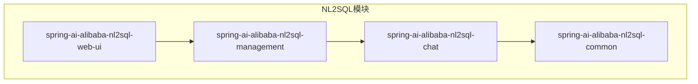
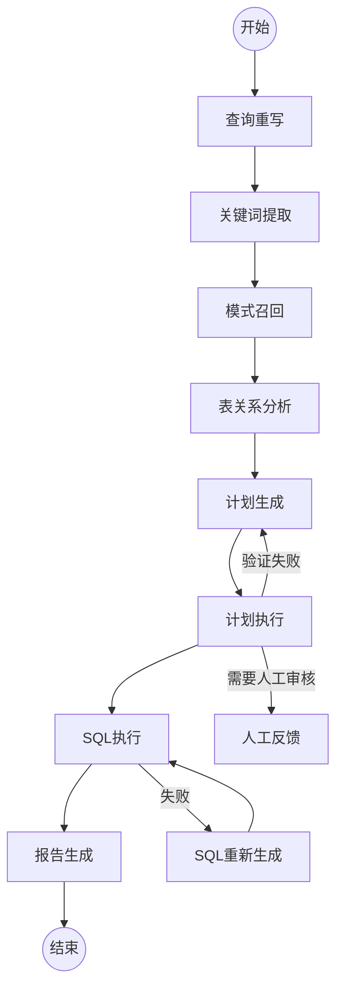
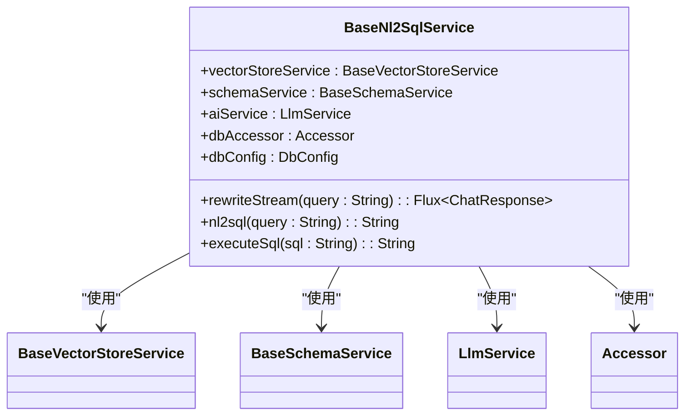
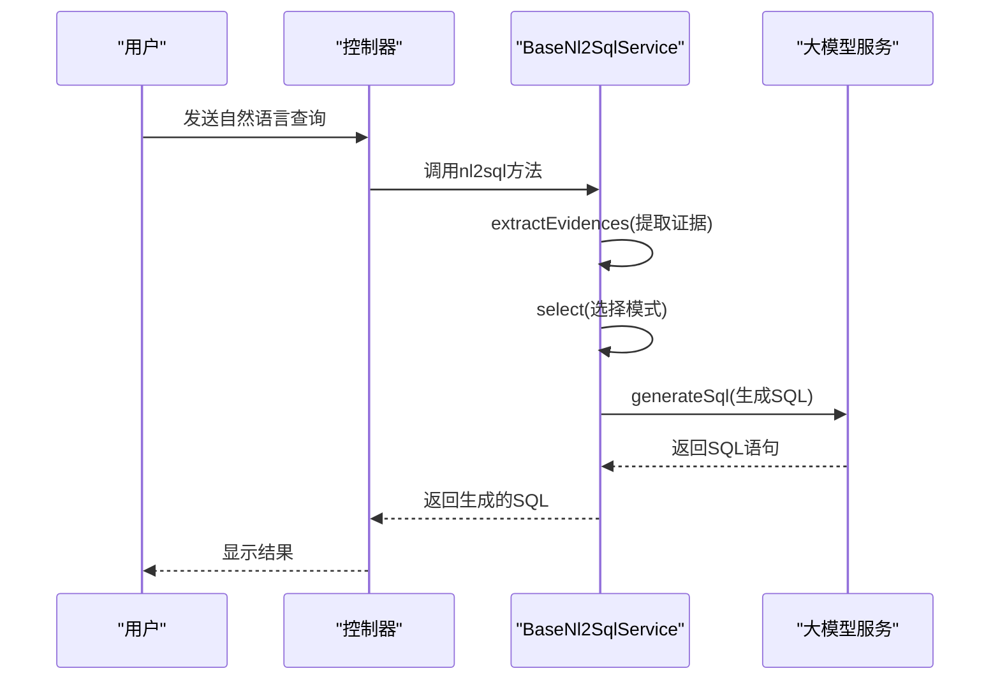
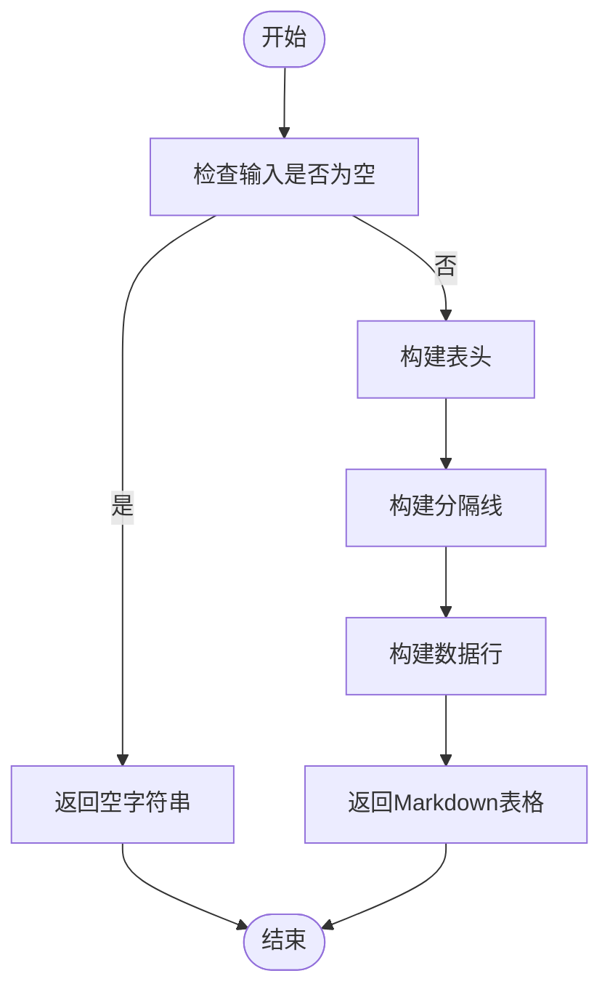
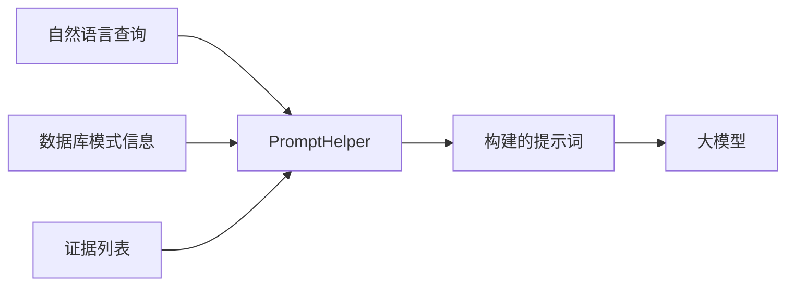

# NL2SQLChatModel组件

<cite>
**本文档引用的文件**
- [Nl2sqlConfiguration.java](file://spring-ai-alibaba-nl2sql/spring-ai-alibaba-nl2sql-chat/src/main/java/com/alibaba/cloud/ai/config/Nl2sqlConfiguration.java)
- [BaseNl2SqlService.java](file://spring-ai-alibaba-nl2sql/spring-ai-alibaba-nl2sql-chat/src/main/java/com/alibaba/cloud/ai/service/base/BaseNl2SqlService.java)
- [SimpleNl2SqlService.java](file://spring-ai-alibaba-nl2sql/spring-ai-alibaba-nl2sql-chat/src/main/java/com/alibaba/cloud/ai/service/simple/SimpleNl2SqlService.java)
- [MdTableGenerator.java](file://spring-ai-alibaba-nl2sql/spring-ai-alibaba-nl2sql-common/src/main/java/com/alibaba/cloud/ai/connector/MdTableGenerator.java)
- [PromptHelper.java](file://spring-ai-alibaba-nl2sql/spring-ai-alibaba-nl2sql-chat/src/main/java/com/alibaba/cloud/ai/prompt/PromptHelper.java)
- [SqlGenerateNode.java](file://spring-ai-alibaba-nl2sql/spring-ai-alibaba-nl2sql-chat/src/main/java/com/alibaba/cloud/ai/node/SqlGenerateNode.java)
- [SimpleVectorStoreService.java](file://spring-ai-alibaba-nl2sql/spring-ai-alibaba-nl2sql-chat/src/main/java/com/alibaba/cloud/ai/service/simple/SimpleVectorStoreService.java)
- [SimpleChatController.java](file://spring-ai-alibaba-nl2sql/spring-ai-alibaba-nl2sql-management/src/main/java/com/alibaba/cloud/ai/controller/SimpleChatController.java)
</cite>

## 目录
1. [简介](#简介)
2. [项目结构](#项目结构)
3. [核心组件](#核心组件)
4. [架构概述](#架构概述)
5. [详细组件分析](#详细组件分析)
6. [依赖关系分析](#依赖关系分析)
7. [性能考虑](#性能考虑)
8. [故障排除指南](#故障排除指南)
9. [结论](#结论)

## 简介
NL2SQLChatModel组件是Spring AI Alibaba框架中的一个关键模块，负责将自然语言查询转换为相应的SQL语句。该组件通过结合数据库模式信息和大模型能力，实现了从用户友好的自然语言到精确的数据库查询语言的智能转换。它在处理复杂查询时采用优化策略，并与NL2SQLToolCall和NL2SQLChatMemory等其他组件协同工作，以提供完整的解决方案。

## 项目结构
NL2SQL模块包含多个子模块，每个子模块都有特定的功能：
- **spring-ai-alibaba-nl2sql-chat**: 核心聊天功能实现
- **spring-ai-alibaba-nl2sql-common**: 共享工具和配置
- **spring-ai-alibaba-nl2sql-management**: 管理和控制接口
- **spring-ai-alibaba-nl2sql-web-ui**: 前端用户界面



**图表来源**
- [Nl2sqlConfiguration.java](file://spring-ai-alibaba-nl2sql/spring-ai-alibaba-nl2sql-chat/src/main/java/com/alibaba/cloud/ai/config/Nl2sqlConfiguration.java)

**章节来源**
- [Nl2sqlConfiguration.java](file://spring-ai-alibaba-nl2sql/spring-ai-alibaba-nl2sql-chat/src/main/java/com/alibaba/cloud/ai/config/Nl2sqlConfiguration.java)

## 核心组件
NL2SQLChatModel的核心在于其能够接收用户的自然语言输入，利用数据库模式信息构建提示词，并调用大模型生成相应的SQL语句。主要涉及以下几个关键类：

- `BaseNl2SqlService`: 提供基础的NL2SQL服务功能
- `SimpleNl2SqlService`: 简化版的NL2SQL服务实现
- `MdTableGenerator`: 将结果集转换为Markdown表格
- `PromptHelper`: 构建各种提示词模板
- `SqlGenerateNode`: SQL生成节点，处理复杂的生成逻辑

**章节来源**
- [BaseNl2SqlService.java](file://spring-ai-alibaba-nl2sql/spring-ai-alibaba-nl2sql-chat/src/main/java/com/alibaba/cloud/ai/service/base/BaseNl2SqlService.java)
- [SimpleNl2SqlService.java](file://spring-ai-alibaba-nl2sql/spring-ai-alibaba-nl2sql-chat/src/main/java/com/alibaba/cloud/ai/service/simple/SimpleNl2SqlService.java)
- [MdTableGenerator.java](file://spring-ai-alibaba-nl2sql/spring-ai-alibaba-nl2sql-common/src/main/java/com/alibaba/cloud/ai/connector/MdTableGenerator.java)
- [PromptHelper.java](file://spring-ai-alibaba-nl2sql/spring-ai-alibaba-nl2sql-chat/src/main/java/com/alibaba/cloud/ai/prompt/PromptHelper.java)
- [SqlGenerateNode.java](file://spring-ai-alibaba-nl2sql/spring-ai-alibaba-nl2sql-chat/src/main/java/com/alibaba/cloud/ai/node/SqlGenerateNode.java)

## 架构概述
NL2SQLChatModel采用状态图（StateGraph）的方式组织整个处理流程，确保了各个步骤之间的有序执行和条件分支判断。



**图表来源**
- [Nl2sqlConfiguration.java](file://spring-ai-alibaba-nl2sql/spring-ai-alibaba-nl2sql-chat/src/main/java/com/alibaba/cloud/ai/config/Nl2sqlConfiguration.java)

## 详细组件分析

### BaseNl2SqlService分析
`BaseNl2SqlService`是所有NL2SQL服务的基础类，提供了基本的方法如`rewriteStream`、`nl2sql`和`executeSql`。

#### 类图


**图表来源**
- [BaseNl2SqlService.java](file://spring-ai-alibaba-nl2sql/spring-ai-alibaba-nl2sql-chat/src/main/java/com/alibaba/cloud/ai/service/base/BaseNl2SqlService.java)

#### 方法调用序列


**图表来源**
- [BaseNl2SqlService.java](file://spring-ai-alibaba-nl2sql/spring-ai-alibaba-nl2sql-chat/src/main/java/com/alibaba/cloud/ai/service/base/BaseNl2SqlService.java)

**章节来源**
- [BaseNl2SqlService.java](file://spring-ai-alibaba-nl2sql/spring-ai-alibaba-nl2sql-chat/src/main/java/com/alibaba/cloud/ai/service/base/BaseNl2SqlService.java)

### MdTableGenerator分析
`MdTableGenerator`负责将数据库查询结果转换为Markdown格式的表格，便于展示。

#### 流程图


**图表来源**
- [MdTableGenerator.java](file://spring-ai-alibaba-nl2sql/spring-ai-alibaba-nl2sql-common/src/main/java/com/alibaba/cloud/ai/connector/MdTableGenerator.java)

**章节来源**
- [MdTableGenerator.java](file://spring-ai-alibaba-nl2sql/spring-ai-alibaba-nl2sql-common/src/main/java/com/alibaba/cloud/ai/connector/MdTableGenerator.java)

### PromptHelper分析
`PromptHelper`类负责构建各种提示词，包括重写提示、关键词提取提示、混合选择器提示等。

#### 数据流图


**图表来源**
- [PromptHelper.java](file://spring-ai-alibaba-nl2sql/spring-ai-alibaba-nl2sql-chat/src/main/java/com/alibaba/cloud/ai/prompt/PromptHelper.java)

**章节来源**
- [PromptHelper.java](file://spring-ai-alibaba-nl2sql/spring-ai-alibaba-nl2sql-chat/src/main/java/com/alibaba/cloud/ai/prompt/PromptHelper.java)

## 依赖关系分析
NL2SQLChatModel与其他组件之间存在紧密的交互关系，特别是与NL2SQLToolCall和NL2SQLChatMemory。

```mermaid
graph TD
NL2SQLChatModel[NL2SQLChatModel]
NL2SQLToolCall[NL2SQLToolCall]
NL2SQLChatMemory[NL2SQLChatMemory]
NL2SQLChatModel --> NL2SQLToolCall : "调用工具"
NL2SQLChatModel --> NL2SQLChatMemory : "存储对话历史"
NL2SQLToolCall --> Database[(数据库)]
NL2SQLChatMemory --> Redis[(Redis)]
```

**图表来源**
- [Nl2sqlConfiguration.java](file://spring-ai-alibaba-nl2sql/spring-ai-alibaba-nl2sql-chat/src/main/java/com/alibaba/cloud/ai/config/Nl2sqlConfiguration.java)
- [SimpleVectorStoreService.java](file://spring-ai-alibaba-nl2sql/spring-ai-alibaba-nl2sql-chat/src/main/java/com/alibaba/cloud/ai/service/simple/SimpleVectorStoreService.java)

**章节来源**
- [Nl2sqlConfiguration.java](file://spring-ai-alibaba-nl2sql/spring-ai-alibaba-nl2sql-chat/src/main/java/com/alibaba/cloud/ai/config/Nl2sqlConfiguration.java)
- [SimpleVectorStoreService.java](file://spring-ai-alibaba-nl2sql/spring-ai-alibaba-nl2sql-chat/src/main/java/com/alibaba/cloud/ai/service/simple/SimpleVectorStoreService.java)

## 性能考虑
在处理复杂查询时，NL2SQLChatModel采用了多轮优化机制来提高SQL质量。`SqlGenerateNode`中的`regenerateSql`方法会进行最多三轮的优化，每轮都会评估SQL的质量分数，包括语法、安全性和性能三个方面。

此外，系统还实现了智能缓存机制，避免重复计算相同的查询模式，从而提升响应速度。

## 故障排除指南
当遇到问题时，可以参考以下常见问题及解决方法：

1. **SQL生成失败**: 检查数据库连接配置和权限设置。
2. **查询结果不准确**: 确认数据库模式信息已正确加载到向量存储中。
3. **性能瓶颈**: 查看是否有大量相似查询导致资源耗尽，考虑增加缓存或优化索引。

**章节来源**
- [SqlGenerateNode.java](file://spring-ai-alibaba-nl2sql/spring-ai-alibaba-nl2sql-chat/src/main/java/com/alibaba/cloud/ai/node/SqlGenerateNode.java)

## 结论
NL2SQLChatModel组件通过集成先进的自然语言处理技术和数据库知识，实现了高效准确的自然语言到SQL的转换。其模块化设计和灵活的架构使得它可以轻松适应不同的应用场景和需求变化。未来可以通过引入更多上下文理解和动态优化策略进一步提升系统的智能化水平。