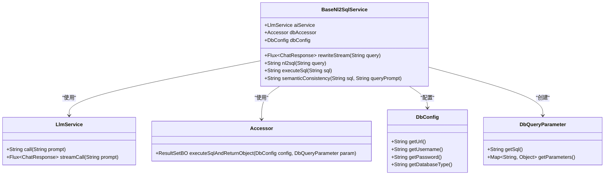

# NL2SQLToolCall组件

<cite>
**本文档中引用的文件**
- [BaseNl2SqlService.java](file://spring-ai-alibaba-nl2sql/spring-ai-alibaba-nl2sql-chat/src/main/java/com/alibaba/cloud/ai/service/base/BaseNl2SqlService.java)
- [SqlExecuteNode.java](file://spring-ai-alibaba-nl2sql/spring-ai-alibaba-nl2sql-chat/src/main/java/com/alibaba/cloud/ai/node/SqlExecuteNode.java)
- [DBConnectionPool.java](file://spring-ai-alibaba-nl2sql/spring-ai-alibaba-nl2sql-common/src/main/java/com/alibaba/cloud/ai/connector/DBConnectionPool.java)
- [DatabaseUseTool.java](file://spring-ai-alibaba-jmanus/src/main/java/com/alibaba/cloud/ai/manus/tool/database/DatabaseUseTool.java)
- [planner.txt](file://spring-ai-alibaba-nl2sql/spring-ai-alibaba-nl2sql-chat/src/main/resources/prompts/planner.txt)
</cite>

## 目录
1. [简介](#简介)
2. [项目结构](#项目结构)
3. [核心组件](#核心组件)
4. [架构概述](#架构概述)
5. [详细组件分析](#详细组件分析)
6. [依赖分析](#依赖分析)
7. [性能考虑](#性能考虑)
8. [故障排除指南](#故障排除指南)
9. [结论](#结论)

## 简介
NL2SQLToolCall组件是Spring AI Alibaba框架中的关键组件，负责执行由NL2SQLChatModel生成的SQL语句。该组件通过安全的数据库连接池机制与目标数据库交互，执行查询并返回结构化结果。它集成了完整的错误处理机制，能够应对SQL语法错误、权限不足和连接超时等异常情况。本组件还实现了参数化查询和结果集大小限制等安全措施，确保与外部数据库系统的集成既高效又安全。

## 项目结构
NL2SQLToolCall组件主要分布在`spring-ai-alibaba-nl2sql`和`spring-ai-alibaba-jmanus`模块中，形成了一个完整的自然语言到SQL转换和执行系统。

**Diagram sources**
- [BaseNl2SqlService.java](file://spring-ai-alibaba-nl2sql/spring-ai-alibaba-nl2sql-chat/src/main/java/com/alibaba/cloud/ai/service/base/BaseNl2SqlService.java)
- [DBConnectionPool.java](file://spring-ai-alibaba-nl2sql/spring-ai-alibaba-nl2sql-common/src/main/java/com/alibaba/cloud/ai/connector/DBConnectionPool.java)
- [SqlExecuteNode.java](file://spring-ai-alibaba-nl2sql/spring-ai-alibaba-nl2sql-chat/src/main/java/com/alibaba/cloud/ai/node/SqlExecuteNode.java)
- [DatabaseUseTool.java](file://spring-ai-alibaba-jmanus/src/main/java/com/alibaba/cloud/ai/manus/tool/database/DatabaseUseTool.java)

**Section sources**
- [BaseNl2SqlService.java](file://spring-ai-alibaba-nl2sql/spring-ai-alibaba-nl2sql-chat/src/main/java/com/alibaba/cloud/ai/service/base/BaseNl2SqlService.java)
- [DBConnectionPool.java](file://spring-ai-alibaba-nl2sql/spring-ai-alibaba-nl2sql-common/src/main/java/com/alibaba/cloud/ai/connector/DBConnectionPool.java)

## 核心组件
NL2SQLToolCall的核心功能由`BaseNl2SqlService`类实现，该类提供了将自然语言查询转换为SQL语句并执行的核心方法。`executeSql`方法负责安全地执行SQL查询，通过`Accessor`接口与数据库交互，并使用`MdTableGenerator`将结果集格式化为Markdown表格。`SqlExecuteNode`作为工作流节点，协调整个SQL执行过程，而`DBConnectionPool`接口则定义了数据库连接池的抽象，确保连接的安全管理和复用。

**Section sources**
- [BaseNl2SqlService.java](file://spring-ai-alibaba-nl2sql/spring-ai-alibaba-nl2sql-chat/src/main/java/com/alibaba/cloud/ai/service/base/BaseNl2SqlService.java)
- [SqlExecuteNode.java](file://spring-ai-alibaba-nl2sql/spring-ai-alibaba-nl2sql-chat/src/main/java/com/alibaba/cloud/ai/node/SqlExecuteNode.java)

## 架构概述
NL2SQLToolCall组件采用分层架构设计，从上至下分为工具调用层、服务逻辑层和数据访问层。工具调用层（如`DatabaseUseTool`）接收来自AI模型的指令，服务逻辑层（`BaseNl2SqlService`）处理业务逻辑和错误处理，数据访问层（`Accessor`和`DBConnectionPool`）负责与数据库的实际交互。这种分层设计确保了关注点分离，提高了代码的可维护性和可测试性。

**Diagram sources**
- [DatabaseUseTool.java](file://spring-ai-alibaba-jmanus/src/main/java/com/alibaba/cloud/ai/manus/tool/database/DatabaseUseTool.java)
- [BaseNl2SqlService.java](file://spring-ai-alibaba-nl2sql/spring-ai-alibaba-nl2sql-chat/src/main/java/com/alibaba/cloud/ai/service/base/BaseNl2SqlService.java)
- [SqlExecuteNode.java](file://spring-ai-alibaba-nl2sql/spring-ai-alibaba-nl2sql-chat/src/main/java/com/alibaba/cloud/ai/node/SqlExecuteNode.java)
- [DBConnectionPool.java](file://spring-ai-alibaba-nl2sql/spring-ai-alibaba-nl2sql-common/src/main/java/com/alibaba/cloud/ai/connector/DBConnectionPool.java)

## 详细组件分析

### BaseNl2SqlService分析
`BaseNl2SqlService`是NL2SQL功能的核心服务类，负责协调自然语言到SQL的转换和执行过程。

#### 类图

**Diagram sources**
- [BaseNl2SqlService.java](file://spring-ai-alibaba-nl2sql/spring-ai-alibaba-nl2sql-chat/src/main/java/com/alibaba/cloud/ai/service/base/BaseNl2SqlService.java)

**Section sources**
- [BaseNl2SqlService.java](file://spring-ai-alibaba-nl2sql/spring-ai-alibaba-nl2sql-chat/src/main/java/com/alibaba/cloud/ai/service/base/BaseNl2SqlService.java)

### SqlExecuteNode分析
`SqlExecuteNode`是工作流中的关键节点，负责执行SQL查询任务。

#### 序列图

**Diagram sources**
- [SqlExecuteNode.java](file://spring-ai-alibaba-nl2sql/spring-ai-alibaba-nl2sql-chat/src/main/java/com/alibaba/cloud/ai/node/SqlExecuteNode.java)
- [BaseNl2SqlService.java](file://spring-ai-alibaba-nl2sql/spring-ai-alibaba-nl2sql-chat/src/main/java/com/alibaba/cloud/ai/service/base/BaseNl2SqlService.java)

## 依赖分析
NL2SQLToolCall组件依赖于多个核心接口和实现，形成了一个松耦合但高度协作的系统。

**Diagram sources**
- [DatabaseUseTool.java](file://spring-ai-alibaba-jmanus/src/main/java/com/alibaba/cloud/ai/manus/tool/database/DatabaseUseTool.java)
- [BaseNl2SqlService.java](file://spring-ai-alibaba-nl2sql/spring-ai-alibaba-nl2sql-chat/src/main/java/com/alibaba/cloud/ai/service/base/BaseNl2SqlService.java)
- [SqlExecuteNode.java](file://spring-ai-alibaba-nl2sql/spring-ai-alibaba-nl2sql-chat/src/main/java/com/alibaba/cloud/ai/node/SqlExecuteNode.java)
- [DBConnectionPool.java](file://spring-ai-alibaba-nl2sql/spring-ai-alibaba-nl2sql-common/src/main/java/com/alibaba/cloud/ai/connector/DBConnectionPool.java)

**Section sources**
- [DatabaseUseTool.java](file://spring-ai-alibaba-jmanus/src/main/java/com/alibaba/cloud/ai/manus/tool/database/DatabaseUseTool.java)
- [BaseNl2SqlService.java](file://spring-ai-alibaba-nl2sql/spring-ai-alibaba-nl2sql-chat/src/main/java/com/alibaba/cloud/ai/service/base/BaseNl2SqlService.java)

## 性能考虑
NL2SQLToolCall组件在设计时充分考虑了性能因素。通过连接池复用数据库连接，避免了频繁建立和断开连接的开销。结果集大小限制防止了大规模数据查询导致的内存溢出。异步流式处理支持允许客户端逐步接收查询结果，提高了响应效率。此外，缓存机制的引入可以避免重复查询相同数据，进一步提升了系统性能。

## 故障排除指南
当NL2SQLToolCall组件出现问题时，可以从以下几个方面进行排查：

1. **数据库连接问题**：检查`DbConfig`配置是否正确，包括URL、用户名、密码和数据库类型。
2. **SQL语法错误**：验证生成的SQL语句是否符合目标数据库的语法规范。
3. **权限不足**：确认数据库用户具有执行查询所需的权限。
4. **连接超时**：检查网络状况和数据库服务器负载，适当调整连接超时设置。
5. **结果集过大**：对于大数据量查询，考虑添加分页或限制条件。

**Section sources**
- [BaseNl2SqlService.java](file://spring-ai-alibaba-nl2sql/spring-ai-alibaba-nl2sql-chat/src/main/java/com/alibaba/cloud/ai/service/base/BaseNl2SqlService.java)
- [SqlExecuteNode.java](file://spring-ai-alibaba-nl2sql/spring-ai-alibaba-nl2sql-chat/src/main/java/com/alibaba/cloud/ai/node/SqlExecuteNode.java)

## 结论
NL2SQLToolCall组件通过精心设计的架构和实现，成功地将自然语言查询转换为安全、高效的数据库操作。其分层设计、完善的错误处理机制和安全特性使其成为连接AI模型与数据库系统的可靠桥梁。未来可以通过引入更智能的查询优化、增强的安全审计功能和更丰富的监控指标来进一步提升组件的能力。