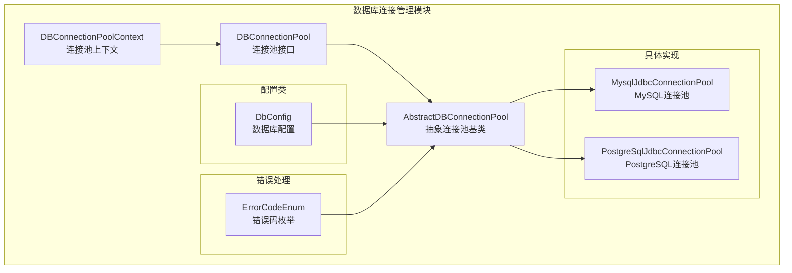
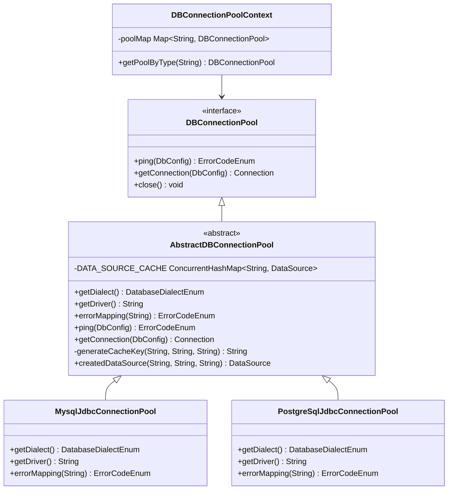
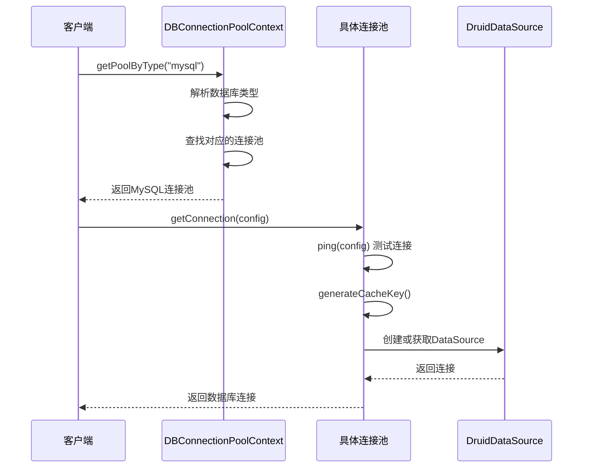
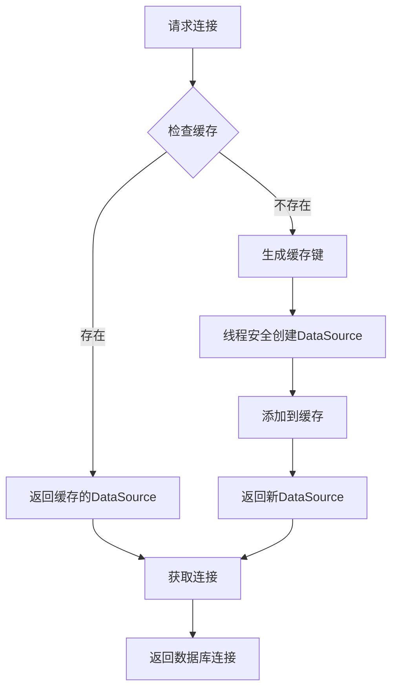
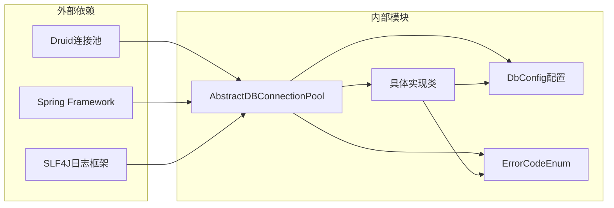

# 数据库连接管理

<cite>
**本文档引用的文件**
- [AbstractDBConnectionPool.java](file://spring-ai-alibaba-nl2sql/spring-ai-alibaba-nl2sql-common/src/main/java/com/alibaba/cloud/ai/connector/AbstractDBConnectionPool.java)
- [DBConnectionPool.java](file://spring-ai-alibaba-nl2sql/spring-ai-alibaba-nl2sql-common/src/main/java/com/alibaba/cloud/ai/connector/DBConnectionPool.java)
- [DBConnectionPoolContext.java](file://spring-ai-alibaba-nl2sql/spring-ai-alibaba-nl2sql-common/src/main/java/com/alibaba/cloud/ai/connector/DBConnectionPoolContext.java)
- [MysqlJdbcConnectionPool.java](file://spring-ai-alibaba-nl2sql/spring-ai-alibaba-nl2sql-common/src/main/java/com/alibaba/cloud/ai/connector/mysql/MysqlJdbcConnectionPool.java)
- [PostgreSqlJdbcConnectionPool.java](file://spring-ai-alibaba-nl2sql/spring-ai-alibaba-nl2sql-common/src/main/java/com/alibaba/cloud/ai/connector/postgre/PostgreSqlJdbcConnectionPool.java)
- [DbConfig.java](file://spring-ai-alibaba-nl2sql/spring-ai-alibaba-nl2sql-common/src/main/java/com/alibaba/cloud/ai/connector/config/DbConfig.java)
- [ErrorCodeEnum.java](file://spring-ai-alibaba-nl2sql/spring-ai-alibaba-nl2sql-common/src/main/java/com/alibaba/cloud/ai/enums/ErrorCodeEnum.java)
</cite>

## 目录
1. [简介](#简介)
2. [项目结构](#项目结构)
3. [核心组件](#核心组件)
4. [架构概览](#架构概览)
5. [详细组件分析](#详细组件分析)
6. [依赖关系分析](#依赖关系分析)
7. [性能考虑](#性能考虑)
8. [故障排除指南](#故障排除指南)
9. [结论](#结论)

## 简介

数据库连接管理模块是Spring AI Alibaba项目中的核心组件，专门负责高效管理数据库连接的创建、复用和释放。该模块通过AbstractDBConnectionPool抽象类和具体的MySQL、PostgreSQL连接池实现，为系统提供了统一的数据库连接管理接口，支持多种数据库类型的连接池管理。

该模块的主要特点包括：
- 基于Druid连接池的高性能连接管理
- 支持MySQL和PostgreSQL数据库
- 提供统一的连接测试和错误处理机制
- 实现了连接缓存和资源优化
- 支持高并发场景下的稳定性和可靠性

## 项目结构

数据库连接管理模块位于NL2SQL项目的common包中，采用分层架构设计：



**图表来源**
- [AbstractDBConnectionPool.java](file://spring-ai-alibaba-nl2sql/spring-ai-alibaba-nl2sql-common/src/main/java/com/alibaba/cloud/ai/connector/AbstractDBConnectionPool.java#L1-L169)
- [DBConnectionPool.java](file://spring-ai-alibaba-nl2sql/spring-ai-alibaba-nl2sql-common/src/main/java/com/alibaba/cloud/ai/connector/DBConnectionPool.java#L1-L43)

**章节来源**
- [AbstractDBConnectionPool.java](file://spring-ai-alibaba-nl2sql/spring-ai-alibaba-nl2sql-common/src/main/java/com/alibaba/cloud/ai/connector/AbstractDBConnectionPool.java#L1-L169)
- [DBConnectionPool.java](file://spring-ai-alibaba-nl2sql/spring-ai-alibaba-nl2sql-common/src/main/java/com/alibaba/cloud/ai/connector/DBConnectionPool.java#L1-L43)

## 核心组件

### DBConnectionPool接口

DBConnectionPool接口定义了数据库连接池的基本操作规范：

```java
public interface DBConnectionPool extends AutoCloseable {
    ErrorCodeEnum ping(DbConfig config);
    Connection getConnection(DbConfig config);
}
```

该接口包含两个核心方法：
- `ping(DbConfig config)`: 测试数据库连接的有效性
- `getConnection(DbConfig config)`: 获取可用的数据库连接

### AbstractDBConnectionPool抽象类

AbstractDBConnectionPool作为所有连接池实现的基础抽象类，提供了以下核心功能：

1. **数据源缓存管理**: 使用ConcurrentHashMap维护数据源实例，避免重复创建
2. **连接测试机制**: 在获取连接前自动测试连接有效性
3. **Druid连接池集成**: 基于阿里巴巴Druid连接池实现
4. **错误状态映射**: 将SQL状态码映射为业务错误码

**章节来源**
- [AbstractDBConnectionPool.java](file://spring-ai-alibaba-nl2sql/spring-ai-alibaba-nl2sql-common/src/main/java/com/alibaba/cloud/ai/connector/AbstractDBConnectionPool.java#L35-L169)
- [DBConnectionPool.java](file://spring-ai-alibaba-nl2sql/spring-ai-alibaba-nl2sql-common/src/main/java/com/alibaba/cloud/ai/connector/DBConnectionPool.java#L25-L43)

## 架构概览

数据库连接管理模块采用工厂模式和策略模式相结合的设计：



**图表来源**
- [AbstractDBConnectionPool.java](file://spring-ai-alibaba-nl2sql/spring-ai-alibaba-nl2sql-common/src/main/java/com/alibaba/cloud/ai/connector/AbstractDBConnectionPool.java#L35-L169)
- [MysqlJdbcConnectionPool.java](file://spring-ai-alibaba-nl2sql/spring-ai-alibaba-nl2sql-common/src/main/java/com/alibaba/cloud/ai/connector/mysql/MysqlJdbcConnectionPool.java#L25-L59)
- [PostgreSqlJdbcConnectionPool.java](file://spring-ai-alibaba-nl2sql/spring-ai-alibaba-nl2sql-common/src/main/java/com/alibaba/cloud/ai/connector/postgre/PostgreSqlJdbcConnectionPool.java#L25-L52)

## 详细组件分析

### 连接池上下文管理

DBConnectionPoolContext负责管理不同类型的数据库连接池实例：



**图表来源**
- [DBConnectionPoolContext.java](file://spring-ai-alibaba-nl2sql/spring-ai-alibaba-nl2sql-common/src/main/java/com/alibaba/cloud/ai/connector/DBConnectionPoolContext.java#L42-L59)
- [AbstractDBConnectionPool.java](file://spring-ai-alibaba-nl2sql/spring-ai-alibaba-nl2sql-common/src/main/java/com/alibaba/cloud/ai/connector/AbstractDBConnectionPool.java#L65-L105)

### MySQL连接池实现

MySQL连接池通过继承AbstractDBConnectionPool实现特定的MySQL连接管理：

```java
@Service("mysqlJdbcConnectionPool")
public class MysqlJdbcConnectionPool extends AbstractDBConnectionPool {
    private final static String DRIVER = "com.mysql.cj.jdbc.Driver";
    
    @Override
    public DatabaseDialectEnum getDialect() {
        return DatabaseDialectEnum.MYSQL;
    }
    
    @Override
    public String getDriver() {
        return DRIVER;
    }
    
    @Override
    public ErrorCodeEnum errorMapping(String sqlState) {
        // MySQL特有的错误状态映射
        return switch (sqlState) {
            case "08S01" -> DATASOURCE_CONNECTION_FAILURE_08S01;
            case "28000" -> PASSWORD_ERROR_28000;
            case "42000" -> DATABASE_NOT_EXIST_42000;
            default -> OTHERS;
        };
    }
}
```

### PostgreSQL连接池实现

PostgreSQL连接池同样继承自AbstractDBConnectionPool，提供PostgreSQL特定的功能：

```java
@Service("postgreSqlJdbcConnectionPool")
public class PostgreSqlJdbcConnectionPool extends AbstractDBConnectionPool {
    
    @Override
    public DatabaseDialectEnum getDialect() {
        return DatabaseDialectEnum.POSTGRESQL;
    }
    
    @Override
    public String getDriver() {
        return "org.postgresql.Driver";
    }
    
    @Override
    public ErrorCodeEnum errorMapping(String sqlState) {
        // PostgreSQL特有的错误状态映射
        return switch (sqlState) {
            case "08S01" -> DATASOURCE_CONNECTION_FAILURE_08S01;
            case "28000" -> PASSWORD_ERROR_28000;
            case "42000" -> DATABASE_NOT_EXIST_42000;
            default -> OTHERS;
        };
    }
}
```

**章节来源**
- [MysqlJdbcConnectionPool.java](file://spring-ai-alibaba-nl2sql/spring-ai-alibaba-nl2sql-common/src/main/java/com/alibaba/cloud/ai/connector/mysql/MysqlJdbcConnectionPool.java#L25-L59)
- [PostgreSqlJdbcConnectionPool.java](file://spring-ai-alibaba-nl2sql/spring-ai-alibaba-nl2sql-common/src/main/java/com/alibaba/cloud/ai/connector/postgre/PostgreSqlJdbcConnectionPool.java#L25-L52)

### 连接缓存机制

AbstractDBConnectionPool实现了高效的连接缓存机制：



**图表来源**
- [AbstractDBConnectionPool.java](file://spring-ai-alibaba-nl2sql/spring-ai-alibaba-nl2sql-common/src/main/java/com/alibaba/cloud/ai/connector/AbstractDBConnectionPool.java#L85-L105)

### 错误处理机制

模块提供了完善的错误处理和状态映射：

```java
public enum ErrorCodeEnum {
    // 标准SQLState错误码
    DATASOURCE_CONNECTION_FAILURE_08001("08001", "无法建立数据库连接"),
    PASSWORD_ERROR_28000("28000", "密码错误"),
    DATABASE_NOT_EXIST_42000("42000", "数据库不存在"),
    
    // 自定义错误码
    SCHEMA_NOT_EXIST_3D070("3D070", "模式不存在"),
    OTHERS("100", "未知错误");
    
    public static ErrorCodeEnum fromCode(String code) {
        for (ErrorCodeEnum rc : values()) {
            if (code.equals(rc.getCode())) {
                return rc;
            }
        }
        return OTHERS;
    }
}
```

**章节来源**
- [ErrorCodeEnum.java](file://spring-ai-alibaba-nl2sql/spring-ai-alibaba-nl2sql-common/src/main/java/com/alibaba/cloud/ai/enums/ErrorCodeEnum.java#L25-L167)

## 依赖关系分析

数据库连接管理模块的依赖关系如下：



**图表来源**
- [AbstractDBConnectionPool.java](file://spring-ai-alibaba-nl2sql/spring-ai-alibaba-nl2sql-common/src/main/java/com/alibaba/cloud/ai/connector/AbstractDBConnectionPool.java#L20-L35)

**章节来源**
- [AbstractDBConnectionPool.java](file://spring-ai-alibaba-nl2sql/spring-ai-alibaba-nl2sql-common/src/main/java/com/alibaba/cloud/ai/connector/AbstractDBConnectionPool.java#L20-L35)

## 性能考虑

### 连接池配置优化

AbstractDBConnectionPool使用Druid连接池，并进行了以下优化配置：

- **初始连接数**: 1个连接
- **最小空闲连接**: 1个连接  
- **最大活跃连接**: 3个连接
- **最大等待时间**: 6秒
- **空闲连接检测间隔**: 60秒
- **启用防火墙过滤器**: wall
- **启用统计监控**: stat

### 缓存策略

- 使用ConcurrentHashMap确保线程安全
- 采用computeIfAbsent避免重复创建DataSource
- 缓存键包含URL、用户名和密码哈希值
- 支持连接池的动态清理和重置

### 资源管理

- 实现AutoCloseable接口，支持自动资源清理
- 提供显式的close()方法用于特殊场景
- 连接获取失败时抛出RuntimeException便于上层处理

## 故障排除指南

### 常见连接问题

1. **连接超时**
   - 检查网络连通性
   - 验证数据库服务状态
   - 调整maxWait参数

2. **认证失败**
   - 验证用户名和密码
   - 检查用户权限设置
   - 确认驱动程序版本兼容性

3. **数据库不存在**
   - 检查数据库名称拼写
   - 验证数据库是否存在
   - 确认schema配置

### 监控和调试

- 启用Druid的stat监控功能
- 查看连接池状态指标
- 监控连接创建和销毁频率
- 分析错误码分布情况

**章节来源**
- [AbstractDBConnectionPool.java](file://spring-ai-alibaba-nl2sql/spring-ai-alibaba-nl2sql-common/src/main/java/com/alibaba/cloud/ai/connector/AbstractDBConnectionPool.java#L140-L167)

## 结论

数据库连接管理模块通过精心设计的架构和实现，为Spring AI Alibaba项目提供了高效、可靠的数据库连接管理能力。主要优势包括：

1. **统一接口设计**: 通过DBConnectionPool接口和AbstractDBConnectionPool抽象类，实现了对多种数据库连接池的统一管理
2. **高性能实现**: 基于Druid连接池，提供了优秀的性能表现和资源利用率
3. **完善错误处理**: 提供了详细的错误码映射和异常处理机制
4. **灵活扩展性**: 支持新的数据库类型扩展，易于维护和升级
5. **高并发支持**: 通过缓存机制和线程安全设计，支持高并发场景

该模块为NL2SQL项目的数据访问层提供了坚实的基础，确保了系统的稳定性和可扩展性。通过合理的配置和监控，可以满足生产环境的各种需求。