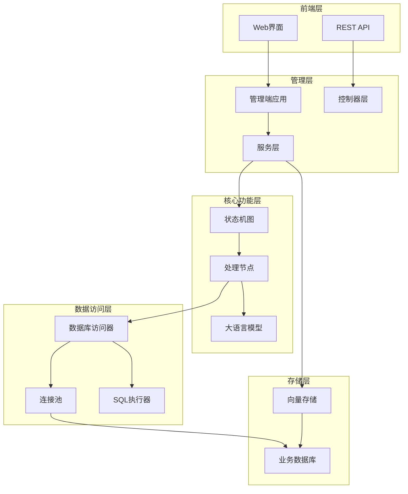
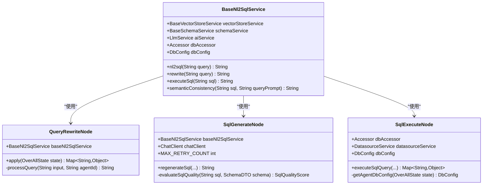
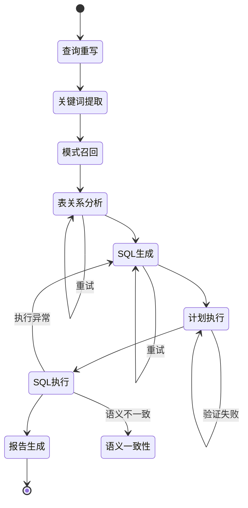
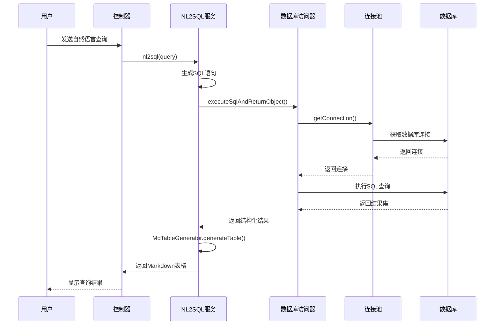
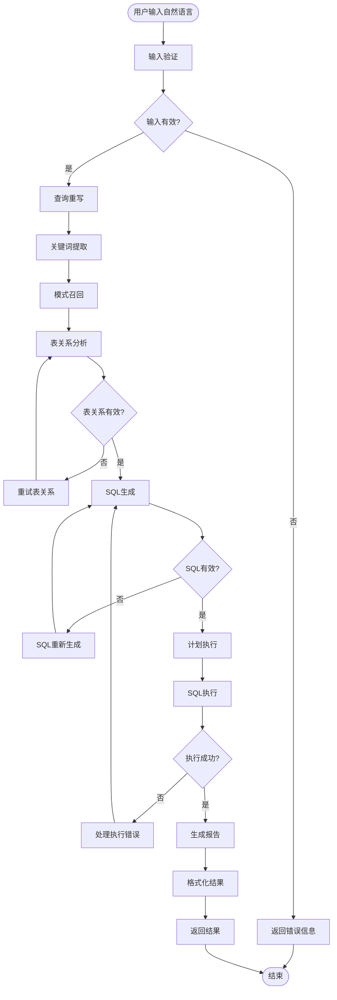
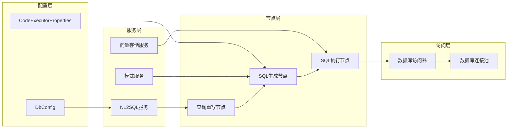
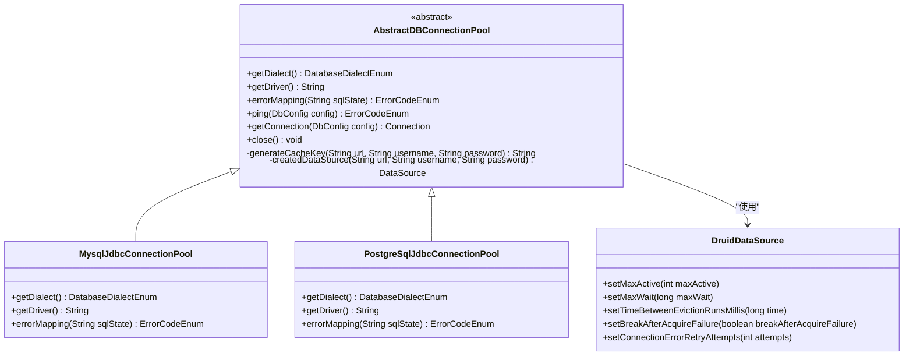
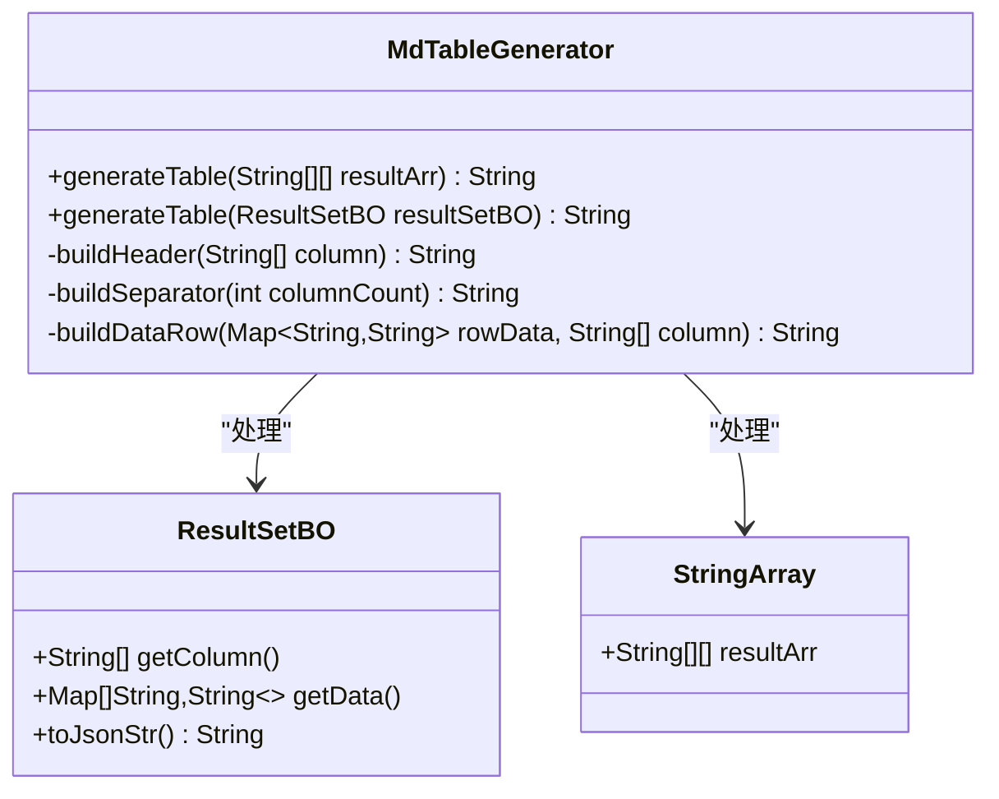

# NL2SQL功能架构设计文档

<cite>
**本文档引用的文件**
- [Nl2sqlConfiguration.java](file://spring-ai-alibaba-nl2sql/spring-ai-alibaba-nl2sql-chat/src/main/java/com/alibaba/cloud/ai/config/Nl2sqlConfiguration.java)
- [BaseNl2SqlService.java](file://spring-ai-alibaba-nl2sql/spring-ai-alibaba-nl2sql-chat/src/main/java/com/alibaba/cloud/ai/service/base/BaseNl2SqlService.java)
- [AbstractDBConnectionPool.java](file://spring-ai-alibaba-nl2sql/spring-ai-alibaba-nl2sql-common/src/main/java/com/alibaba/cloud/ai/connector/AbstractDBConnectionPool.java)
- [MdTableGenerator.java](file://spring-ai-alibaba-nl2sql/spring-ai-alibaba-nl2sql-common/src/main/java/com/alibaba/cloud/ai/connector/MdTableGenerator.java)
- [QueryRewriteNode.java](file://spring-ai-alibaba-nl2sql/spring-ai-alibaba-nl2sql-chat/src/main/java/com/alibaba/cloud/ai/node/QueryRewriteNode.java)
- [SqlGenerateNode.java](file://spring-ai-alibaba-nl2sql/spring-ai-alibaba-nl2sql-chat/src/main/java/com/alibaba/cloud/ai/node/SqlGenerateNode.java)
- [SqlExecuteNode.java](file://spring-ai-alibaba-nl2sql/spring-ai-alibaba-nl2sql-chat/src/main/java/com/alibaba/cloud/ai/node/SqlExecuteNode.java)
- [SqlExecutor.java](file://spring-ai-alibaba-nl2sql/spring-ai-alibaba-nl2sql-common/src/main/java/com/alibaba/cloud/ai/connector/SqlExecutor.java)
- [SimpleChatController.java](file://spring-ai-alibaba-nl2sql/spring-ai-alibaba-nl2sql-management/src/main/java/com/alibaba/cloud/ai/controller/SimpleChatController.java)
</cite>

## 目录
1. [项目概述](#项目概述)
2. [系统架构概览](#系统架构概览)
3. [核心组件分析](#核心组件分析)
4. [数据流分析](#数据流分析)
5. [组件交互关系](#组件交互关系)
6. [数据库连接管理](#数据库连接管理)
7. [表结构生成器](#表结构生成器)
8. [性能考虑](#性能考虑)
9. [故障排除指南](#故障排除指南)
10. [总结](#总结)

## 项目概述

NL2SQL功能是一个基于Spring AI Alibaba的自然语言转SQL系统，能够将用户的自然语言查询转换为可执行的SQL语句。该系统通过状态机驱动的流程管理，结合大语言模型（LLM）和数据库连接池技术，实现了从自然语言到SQL查询的完整转换链路。

系统主要特点：
- **多阶段处理**：通过查询重写、关键词提取、模式召回、表关系分析等多阶段处理
- **智能优化**：支持SQL语法检查、安全验证、性能评估和多轮优化
- **流式响应**：提供实时的处理进度反馈和结果展示
- **灵活扩展**：支持多种数据库类型和自定义数据源配置

## 系统架构概览

NL2SQL系统采用分层架构设计，包含管理端、核心功能模块和公共组件三个层次：

**图表来源**
- [Nl2sqlConfiguration.java](file://spring-ai-alibaba-nl2sql/spring-ai-alibaba-nl2sql-chat/src/main/java/com/alibaba/cloud/ai/config/Nl2sqlConfiguration.java#L76-L240)
- [SimpleChatController.java](file://spring-ai-alibaba-nl2sql/spring-ai-alibaba-nl2sql-management/src/main/java/com/alibaba/cloud/ai/controller/SimpleChatController.java#L33-L54)

## 核心组件分析

### NL2SQLChatModel（NL2SQL聊天模型）

NL2SQLChatModel是整个系统的协调中心，负责管理NL2SQL流程的状态流转和任务调度。它通过Spring的依赖注入机制，整合了多个核心服务组件：

**图表来源**
- [BaseNl2SqlService.java](file://spring-ai-alibaba-nl2sql/spring-ai-alibaba-nl2sql-chat/src/main/java/com/alibaba/cloud/ai/service/base/BaseNl2SqlService.java#L59-L94)
- [QueryRewriteNode.java](file://spring-ai-alibaba-nl2sql/spring-ai-alibaba-nl2sql-chat/src/main/java/com/alibaba/cloud/ai/node/QueryRewriteNode.java#L44-L71)
- [SqlGenerateNode.java](file://spring-ai-alibaba-nl2sql/spring-ai-alibaba-nl2sql-chat/src/main/java/com/alibaba/cloud/ai/node/SqlGenerateNode.java#L58-L85)
- [SqlExecuteNode.java](file://spring-ai-alibaba-nl2sql/spring-ai-alibaba-nl2sql-chat/src/main/java/com/alibaba/cloud/ai/node/SqlExecuteNode.java#L48-L60)

### NL2SQLChatMemory（NL2SQL聊天记忆）

NL2SQLChatMemory负责维护对话上下文和状态信息，确保在多轮对话中保持语境连贯性。它通过状态机图（StateGraph）管理整个NL2SQL流程的状态转换：

**图表来源**
- [Nl2sqlConfiguration.java](file://spring-ai-alibaba-nl2sql/spring-ai-alibaba-nl2sql-chat/src/main/java/com/alibaba/cloud/ai/config/Nl2sqlConfiguration.java#L130-L200)

### NL2SQLToolCall（NL2SQL工具调用）

NL2SQLToolCall负责执行生成的SQL语句并返回结果。它通过数据库访问器（Accessor）和SQL执行器（SqlExecutor）完成具体的数据库操作：

**图表来源**
- [BaseNl2SqlService.java](file://spring-ai-alibaba-nl2sql/spring-ai-alibaba-nl2sql-chat/src/main/java/com/alibaba/cloud/ai/service/base/BaseNl2SqlService.java#L110-L130)
- [SqlExecuteNode.java](file://spring-ai-alibaba-nl2sql/spring-ai-alibaba-nl2sql-chat/src/main/java/com/alibaba/cloud/ai/node/SqlExecuteNode.java#L120-L180)

**章节来源**
- [BaseNl2SqlService.java](file://spring-ai-alibaba-nl2sql/spring-ai-alibaba-nl2sql-chat/src/main/java/com/alibaba/cloud/ai/service/base/BaseNl2SqlService.java#L59-L130)
- [SqlExecuteNode.java](file://spring-ai-alibaba-nl2sql/spring-ai-alibaba-nl2sql-chat/src/main/java/com/alibaba/cloud/ai/node/SqlExecuteNode.java#L48-L120)

## 数据流分析

NL2SQL系统的数据流遵循严格的处理管道，每个阶段都有明确的输入输出规范：

**图表来源**
- [Nl2sqlConfiguration.java](file://spring-ai-alibaba-nl2sql/spring-ai-alibaba-nl2sql-chat/src/main/java/com/alibaba/cloud/ai/config/Nl2sqlConfiguration.java#L130-L200)
- [SqlGenerateNode.java](file://spring-ai-alibaba-nl2sql/spring-ai-alibaba-nl2sql-chat/src/main/java/com/alibaba/cloud/ai/node/SqlGenerateNode.java#L85-L150)

## 组件交互关系

NL2SQL系统的各个组件通过精心设计的接口和依赖注入机制进行交互：

**图表来源**
- [Nl2sqlConfiguration.java](file://spring-ai-alibaba-nl2sql/spring-ai-alibaba-nl2sql-chat/src/main/java/com/alibaba/cloud/ai/config/Nl2sqlConfiguration.java#L76-L100)
- [BaseNl2SqlService.java](file://spring-ai-alibaba-nl2sql/spring-ai-alibaba-nl2sql-chat/src/main/java/com/alibaba/cloud/ai/service/base/BaseNl2SqlService.java#L59-L75)

**章节来源**
- [Nl2sqlConfiguration.java](file://spring-ai-alibaba-nl2sql/spring-ai-alibaba-nl2sql-chat/src/main/java/com/alibaba/cloud/ai/config/Nl2sqlConfiguration.java#L76-L240)
- [BaseNl2SqlService.java](file://spring-ai-alibaba-nl2sql/spring-ai-alibaba-nl2sql-chat/src/main/java/com/alibaba/cloud/ai/service/base/BaseNl2SqlService.java#L59-L94)

## 数据库连接管理

NL2SQL系统通过AbstractDBConnectionPool抽象类实现了统一的数据库连接管理机制。该机制支持多种数据库类型，并提供了连接池管理和缓存优化：

**图表来源**
- [AbstractDBConnectionPool.java](file://spring-ai-alibaba-nl2sql/spring-ai-alibaba-nl2sql-common/src/main/java/com/alibaba/cloud/ai/connector/AbstractDBConnectionPool.java#L35-L100)

连接池的关键特性包括：
- **线程安全**：使用ConcurrentHashMap确保并发安全
- **连接复用**：通过缓存机制减少连接创建开销
- **自动回收**：定期清理空闲连接，释放资源
- **错误处理**：提供详细的错误映射和诊断信息

**章节来源**
- [AbstractDBConnectionPool.java](file://spring-ai-alibaba-nl2sql/spring-ai-alibaba-nl2sql-common/src/main/java/com/alibaba/cloud/ai/connector/AbstractDBConnectionPool.java#L35-L169)

## 表结构生成器

MdTableGenerator负责将数据库查询结果转换为Markdown格式的表格，便于用户阅读和理解：

**图表来源**
- [MdTableGenerator.java](file://spring-ai-alibaba-nl2sql/spring-ai-alibaba-nl2sql-common/src/main/java/com/alibaba/cloud/ai/connector/MdTableGenerator.java#L25-L85)

生成的Markdown表格具有以下特点：
- **标准格式**：符合Markdown表格规范
- **自动适配**：根据列数动态调整表格宽度
- **数据类型感知**：正确处理各种数据类型的显示
- **性能优化**：支持大数据量的高效转换

**章节来源**
- [MdTableGenerator.java](file://spring-ai-alibaba-nl2sql/spring-ai-alibaba-nl2sql-common/src/main/java/com/alibaba/cloud/ai/connector/MdTableGenerator.java#L25-L85)

## 性能考虑

NL2SQL系统在设计时充分考虑了性能优化，主要体现在以下几个方面：

### 连接池优化
- **连接复用**：通过Druid连接池实现连接复用，减少连接创建开销
- **参数调优**：合理设置最大连接数、超时时间等参数
- **监控告警**：提供连接池使用情况的监控指标

### 查询优化
- **结果限制**：默认限制查询结果为1000行，防止内存溢出
- **超时控制**：设置30秒查询超时，避免长时间阻塞
- **索引利用**：通过表关系分析优化查询路径

### 缓存策略
- **模式缓存**：缓存数据库模式信息，减少重复查询
- **向量缓存**：缓存向量存储中的模式信息
- **结果缓存**：对相同查询结果进行缓存

## 故障排除指南

### 常见问题及解决方案

1. **数据库连接失败**
   - 检查数据库URL、用户名和密码配置
   - 验证网络连通性和防火墙设置
   - 确认数据库服务正在运行

2. **SQL生成失败**
   - 检查LLM服务可用性
   - 验证数据库模式信息完整性
   - 确认表关系分析正确性

3. **查询性能问题**
   - 分析查询执行计划
   - 检查索引使用情况
   - 优化查询条件和过滤器

4. **内存不足**
   - 调整连接池大小参数
   - 减少查询结果集大小
   - 增加系统内存配置

**章节来源**
- [SqlExecuteNode.java](file://spring-ai-alibaba-nl2sql/spring-ai-alibaba-nl2sql-chat/src/main/java/com/alibaba/cloud/ai/node/SqlExecuteNode.java#L120-L180)
- [AbstractDBConnectionPool.java](file://spring-ai-alibaba-nl2sql/spring-ai-alibaba-nl2sql-common/src/main/java/com/alibaba/cloud/ai/connector/AbstractDBConnectionPool.java#L50-L80)

## 总结

NL2SQL功能通过精心设计的架构和组件协作，实现了从自然语言到SQL查询的完整转换流程。系统的主要优势包括：

1. **模块化设计**：清晰的组件划分和职责分离
2. **可扩展性**：支持多种数据库类型和自定义扩展
3. **高性能**：通过连接池和缓存机制优化性能
4. **可靠性**：完善的错误处理和重试机制
5. **易用性**：提供直观的Web界面和REST API

该架构为构建企业级NL2SQL应用提供了坚实的基础，能够满足复杂业务场景下的自然语言查询需求。通过持续的优化和扩展，系统将进一步提升用户体验和处理能力。