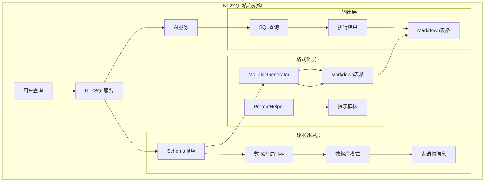
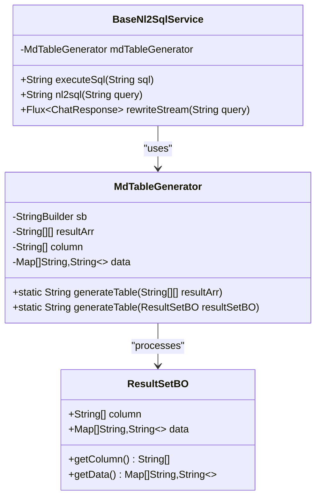
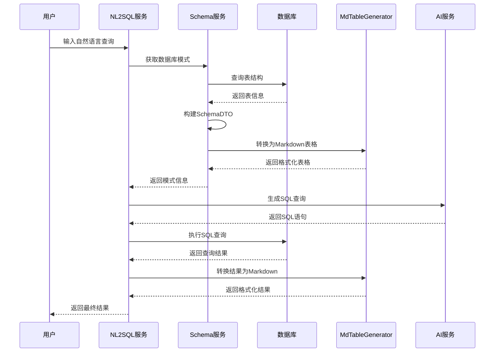

# MdTableGenerator组件文档

<cite>
**本文档引用的文件**
- [MdTableGenerator.java](file://spring-ai-alibaba-nl2sql/spring-ai-alibaba-nl2sql-common/src/main/java/com/alibaba/cloud/ai/connector/MdTableGenerator.java)
- [BaseNl2SqlService.java](file://spring-ai-alibaba-nl2sql/spring-ai-alibaba-nl2sql-chat/src/main/java/com/alibaba/cloud/ai/service/base/BaseNl2SqlService.java)
- [BaseSchemaService.java](file://spring-ai-alibaba-nl2sql/spring-ai-alibaba-nl2sql-chat/src/main/java/com/alibaba/cloud/ai/service/base/BaseSchemaService.java)
- [PromptHelper.java](file://spring-ai-alibaba-nl2sql/spring-ai-alibaba-nl2sql-chat/src/main/java/com/alibaba/cloud/ai/prompt/PromptHelper.java)
- [SimpleChatController.java](file://spring-ai-alibaba-nl2sql/spring-ai-alibaba-nl2sql-management/src/main/java/com/alibaba/cloud/ai/controller/SimpleChatController.java)
- [BaseNl2SqlServiceTest.java](file://spring-ai-alibaba-nl2sql/spring-ai-alibaba-nl2sql-chat/src/test/java/com/alibaba/cloud/ai/service/base/BaseNl2SqlServiceTest.java)
</cite>

## 目录
1. [简介](#简介)
2. [核心架构](#核心架构)
3. [组件分析](#组件分析)
4. [NL2SQL流程集成](#nl2sql流程集成)
5. [使用示例](#使用示例)
6. [性能考虑](#性能考虑)
7. [故障排除](#故障排除)
8. [总结](#总结)

## 简介

MdTableGenerator是Spring AI Alibaba NL2SQL模块中的一个核心组件，专门负责将数据库模式信息转换为Markdown格式的表格描述。该组件在NL2SQL流程中扮演着关键角色，为NL2SQLChatModel提供必要的上下文信息，以生成准确的SQL查询。

MdTableGenerator的主要职责包括：
- 从数据库元数据（表名、列名、数据类型、主键、外键等）生成结构化的Markdown表格
- 将查询结果集转换为易读的Markdown格式
- 为大语言模型提供清晰的数据结构描述
- 支持多种数据源和数据库方言

## 核心架构



**图表来源**
- [BaseNl2SqlService.java](file://spring-ai-alibaba-nl2sql/spring-ai-alibaba-nl2sql-chat/src/main/java/com/alibaba/cloud/ai/service/base/BaseNl2SqlService.java#L1-L50)
- [MdTableGenerator.java](file://spring-ai-alibaba-nl2sql/spring-ai-alibaba-nl2sql-common/src/main/java/com/alibaba/cloud/ai/connector/MdTableGenerator.java#L1-L30)

## 组件分析

### MdTableGenerator类结构



**图表来源**
- [MdTableGenerator.java](file://spring-ai-alibaba-nl2sql/spring-ai-alibaba-nl2sql-common/src/main/java/com/alibaba/cloud/ai/connector/MdTableGenerator.java#L25-L85)
- [BaseNl2SqlService.java](file://spring-ai-alibaba-nl2sql/spring-ai-alibaba-nl2sql-chat/src/main/java/com/alibaba/cloud/ai/service/base/BaseNl2SqlService.java#L40-L60)

### 核心方法实现

MdTableGenerator提供了两个主要的静态方法来处理不同的输入格式：

#### 1. 二维数组转换方法

```java
public static String generateTable(String[][] resultArr) {
    if (resultArr == null || resultArr.length == 0) {
        return "";
    }
    
    StringBuilder sb = new StringBuilder();
    
    // Header
    sb.append("| ");
    for (String col : resultArr[0]) {
        sb.append(col).append(" | ");
    }
    sb.append("\n");
    
    // Separator line
    sb.append("|---".repeat(resultArr[0].length)).append("|\n");
    
    // Data rows
    for (int i = 1; i < resultArr.length; i++) {
        sb.append("| ");
        for (String cell : resultArr[i]) {
            sb.append(cell).append(" | ");
        }
        sb.append("\n");
    }
    
    return sb.toString();
}
```

#### 2. ResultSetBO转换方法

```java
public static String generateTable(ResultSetBO resultSetBO) {
    List<String> column = resultSetBO.getColumn();
    List<Map<String, String>> data = resultSetBO.getData();
    
    String[][] resultArr = new String[data.size() + 1][column.size()];
    int idxR = 0;
    
    resultArr[idxR++] = column.toArray(new String[0]);
    
    for (Map<String, String> kv : data) {
        String[] row = new String[column.size()];
        int idxC = 0;
        for (String c : column) {
            row[idxC++] = kv.get(c);
        }
        resultArr[idxR++] = row;
    }
    
    return generateTable(resultArr);
}
```

**章节来源**
- [MdTableGenerator.java](file://spring-ai-alibaba-nl2sql/spring-ai-alibaba-nl2sql-common/src/main/java/com/alibaba/cloud/ai/connector/MdTableGenerator.java#L25-L85)

## NL2SQL流程集成

### 数据库模式扫描与转换



**图表来源**
- [BaseNl2SqlService.java](file://spring-ai-alibaba-nl2sql/spring-ai-alibaba-nl2sql-chat/src/main/java/com/alibaba/cloud/ai/service/base/BaseNl2SqlService.java#L140-L150)
- [BaseSchemaService.java](file://spring-ai-alibaba-nl2sql/spring-ai-alibaba-nl2sql-chat/src/main/java/com/alibaba/cloud/ai/service/base/BaseSchemaService.java#L60-L90)

### 关键集成点

MdTableGenerator在NL2SQL流程中的关键集成点包括：

1. **Schema信息提取阶段**：将数据库表结构转换为Markdown格式
2. **SQL执行结果处理阶段**：将查询结果转换为易读的表格格式
3. **提示模板构建阶段**：为AI模型提供结构化的上下文信息

```java
// 在BaseNl2SqlService中的使用示例
public String executeSql(String sql) throws Exception {
    try {
        DbQueryParameter param = DbQueryParameter.from(dbConfig).setSql(sql);
        ResultSetBO resultSet = dbAccessor.executeSqlAndReturnObject(dbConfig, param);
        String result = MdTableGenerator.generateTable(resultSet);
        return result;
    }
    catch (Exception e) {
        throw e;
    }
}
```

**章节来源**
- [BaseNl2SqlService.java](file://spring-ai-alibaba-nl2sql/spring-ai-alibaba-nl2sql-chat/src/main/java/com/alibaba/cloud/ai/service/base/BaseNl2SqlService.java#L140-L150)

## 使用示例

### 示例1：基础Markdown表格生成

```java
// 创建测试数据
String[][] testData = {
    {"ID", "Name", "Age"},
    {"1", "张三", "25"},
    {"2", "李四", "30"},
    {"3", "王五", "28"}
};

// 生成Markdown表格
String markdownTable = MdTableGenerator.generateTable(testData);
System.out.println(markdownTable);
```

输出结果：
```
| ID | Name | Age |
|---|---|---|
| 1 | 张三 | 25 |
| 2 | 李四 | 30 |
| 3 | 王五 | 28 |
```

### 示例2：从ResultSetBO生成表格

```java
// 创建ResultSetBO对象
ResultSetBO resultSetBO = new ResultSetBO();
resultSetBO.setColumn(Arrays.asList("id", "name", "age"));

List<Map<String, String>> data = new ArrayList<>();
Map<String, String> row1 = new HashMap<>();
row1.put("id", "1");
row1.put("name", "John");
row1.put("age", "25");
data.add(row1);

resultSetBO.setData(data);

// 生成Markdown表格
String markdownTable = MdTableGenerator.generateTable(resultSetBO);
System.out.println(markdownTable);
```

### 示例3：NL2SQL流程中的实际应用

```java
// 在NL2SQL服务中使用
public String nl2sql(String query) throws Exception {
    // 1. 提取证据和关键词
    List<String> evidences = extractEvidences(query);
    
    // 2. 选择相关表
    SchemaDTO schemaDTO = select(query, evidences);
    
    // 3. 生成SQL
    String sql = generateSql(evidences, query, schemaDTO);
    
    // 4. 执行SQL并生成Markdown结果
    String result = executeSql(sql);
    
    return result;
}

private String executeSql(String sql) throws Exception {
    DbQueryParameter param = DbQueryParameter.from(dbConfig).setSql(sql);
    ResultSetBO resultSet = dbAccessor.executeSqlAndReturnObject(dbConfig, param);
    
    // 使用MdTableGenerator转换结果
    return MdTableGenerator.generateTable(resultSet);
}
```

**章节来源**
- [BaseNl2SqlServiceTest.java](file://spring-ai-alibaba-nl2sql/spring-ai-alibaba-nl2sql-chat/src/test/java/com/alibaba/cloud/ai/service/base/BaseNl2SqlServiceTest.java#L260-L280)

## 性能考虑

### 内存使用优化

MdTableGenerator采用StringBuilder进行字符串拼接，避免频繁的对象创建：

```java
// 高效的字符串构建方式
StringBuilder sb = new StringBuilder();
sb.append("| ");
for (String col : resultArr[0]) {
    sb.append(col).append(" | ");
}
sb.append("\n");
```

### 大数据集处理

对于大型查询结果，MdTableGenerator会自动截断长样本数据：

```java
private static List<String> processSamples(List<String> samples, ColumnDTO columnDTO) {
    final List<String> data = new ArrayList<>(samples);
    
    // 截断过长的样本数据
    if (data.stream().anyMatch(item -> item.length() > 50)) {
        return new ArrayList<>();
    }
    
    // 只保留少量示例
    return data.subList(0, Math.min(3, data.size()));
}
```

### 缓存策略

在NL2SQL流程中，生成的Markdown表格会被缓存以提高性能：

- Schema信息缓存：避免重复查询数据库结构
- 提示模板缓存：复用格式化后的上下文信息
- 结果格式化缓存：减少重复的表格转换操作

## 故障排除

### 常见问题及解决方案

#### 1. 空结果处理

```java
// 空结果的安全检查
public static String generateTable(String[][] resultArr) {
    if (resultArr == null || resultArr.length == 0) {
        return ""; // 返回空字符串而不是抛出异常
    }
    // ...
}
```

#### 2. 数据类型处理

```java
// 处理可能为空的数据
String cellValue = cell == null ? "" : cell;
sb.append(cellValue).append(" | ");
```

#### 3. 字符编码问题

```java
// 确保正确的字符编码处理
String[][] resultArr = new String[data.size() + 1][column.size()];
for (Map<String, String> kv : data) {
    String[] row = new String[column.size()];
    int idxC = 0;
    for (String c : column) {
        row[idxC++] = kv.get(c); // 自动处理null值
    }
    resultArr[idxR++] = row;
}
```

**章节来源**
- [MdTableGenerator.java](file://spring-ai-alibaba-nl2sql/spring-ai-alibaba-nl2sql-common/src/main/java/com/alibaba/cloud/ai/connector/MdTableGenerator.java#L25-L40)

## 总结

MdTableGenerator组件是Spring AI Alibaba NL2SQL系统中的关键基础设施，它通过以下方式为整个NL2SQL流程提供价值：

1. **标准化数据格式**：将复杂的数据库结构转换为统一的Markdown表格格式
2. **提升可读性**：为大语言模型提供清晰、结构化的上下文信息
3. **增强用户体验**：将查询结果以直观的表格形式展示给用户
4. **支持多种数据源**：兼容不同的数据库类型和查询结果格式

该组件的设计体现了以下原则：
- **简洁性**：提供简单易用的API接口
- **高效性**：优化内存使用和字符串处理性能
- **可靠性**：完善的空值处理和错误处理机制
- **扩展性**：支持未来的新功能和数据格式

通过与其他组件的紧密集成，MdTableGenerator为NL2SQL系统提供了强大的数据处理能力，使得自然语言查询能够准确、高效地转换为SQL语句，并以用户友好的方式呈现结果。