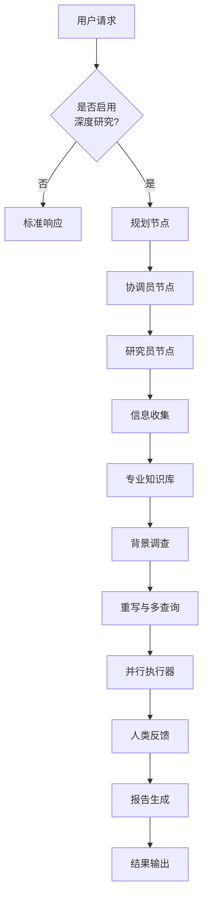
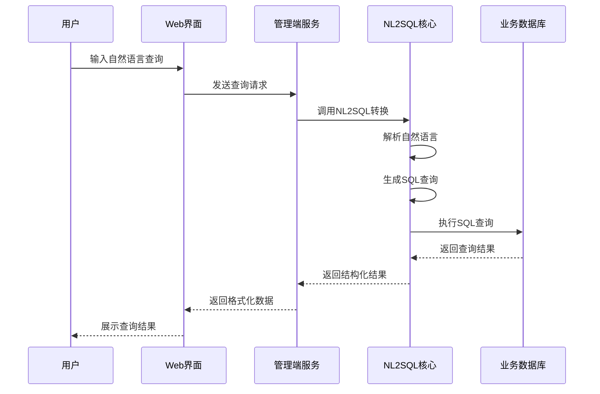
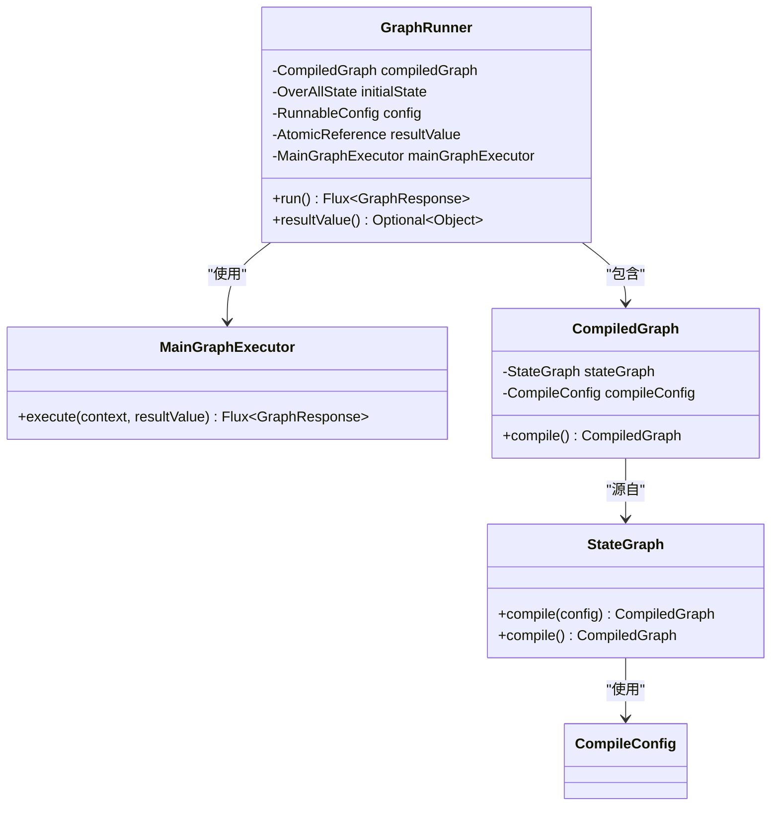

# 高级功能

<cite>
**本文档中引用的文件**   
- [JManusApplication.java](file://spring-ai-alibaba-jmanus/src/main/java/com/alibaba/cloud/ai/manus/OpenManusSpringBootApplication.java)
- [DeepResearchApplication.java](file://spring-ai-alibaba-deepresearch/src/main/java/com/alibaba/cloud/ai/example/deepresearch/DeepResearchApplication.java)
- [Application.java](file://spring-ai-alibaba-nl2sql/spring-ai-alibaba-nl2sql-management/src/main/java/com/alibaba/cloud/ai/Application.java)
- [GraphRunner.java](file://spring-ai-alibaba-graph-core/src/main/java/com/alibaba/cloud/ai/graph/GraphRunner.java)
- [StateGraph.java](file://spring-ai-alibaba-graph-core/src/main/java/com/alibaba/cloud/ai/graph/StateGraph.java)
- [DeepResearchProperties.java](file://spring-ai-alibaba-deepresearch/src/main/java/com/alibaba/cloud/ai/example/deepresearch/config/DeepResearchProperties.java)
- [README.md](file://spring-ai-alibaba-jmanus/README.md)
- [README-zh.md](file://spring-ai-alibaba-deepresearch/README-zh.md)
- [README.md](file://spring-ai-alibaba-nl2sql/README.md)
</cite>

## 目录
1. [引言](#引言)
2. [JManus智能体平台](#jmanus智能体平台)
3. [DeepResearch深度研究代理](#deepresearch深度研究代理)
4. [NL2SQL自然语言转SQL](#nl2sql自然语言转sql)
5. [核心架构与集成](#核心架构与集成)
6. [配置选项与使用场景](#配置选项与使用场景)
7. [企业级应用价值](#企业级应用价值)
8. [结论](#结论)

## 引言
本高级功能文档深入探讨了Spring AI Alibaba框架中的三个核心高级功能模块：JManus智能体平台、DeepResearch深度研究代理和NL2SQL自然语言转SQL功能。这些功能代表了框架在人工智能应用领域的前沿能力，为开发者提供了构建复杂AI系统所需的强大工具。通过详细分析每个功能的架构设计、核心算法和实际应用场景，本文旨在为希望探索框架极限的高级用户提供全面的技术洞察。

## JManus智能体平台
JManus是一个基于Java实现的通用AI智能体平台，它复刻了OpenManus的产品能力，并通过Spring AI Alibaba框架实现了完整的多智能体协作系统。该平台定位从最初的完全开源复刻演变为一个智能体开发平台，专注于帮助企业用户构建垂直领域的定制化智能体解决方案。

JManus的核心优势在于其纯Java实现，为Java开发者提供了完整的HTTP调用接口，便于二次集成。平台支持PLAN-ACT模式，使智能体具备复杂推理、分步执行和动态调整的能力，适用于多轮对话、复杂决策和自动化流程等高阶AI应用场景。通过直观的Web管理界面，开发者和运维人员可以无需修改底层代码，灵活调整智能体的参数、模型和工具，极大地提升了系统的易用性和运维效率。

平台还无缝支持MCP（Model Context Protocol）工具集成，这意味着智能体不仅能调用本地或云端的大语言模型，还能与各类外部服务、API和数据库进行深度交互，极大拓展了应用场景和能力边界。此外，JManus支持无限上下文处理，能够从海量内容中精确提取目标信息，而不依赖于特定的长上下文模型。

**Section sources**
- [OpenManusSpringBootApplication.java](file://spring-ai-alibaba-jmanus/src/main/java/com/alibaba/cloud/ai/manus/OpenManusSpringBootApplication.java)
- [README.md](file://spring-ai-alibaba-jmanus/README.md)

## DeepResearch深度研究代理
DeepResearch是基于spring-ai-alibaba-graph实现的深度研究系统，专为需要复杂推理和多步骤执行的研究型任务而设计。该系统通过图结构的工作流引擎，将复杂的查询分解为多个可管理的子任务，实现对问题的系统性分析和解答。

**Diagram sources **
- [DeepResearchApplication.java](file://spring-ai-alibaba-deepresearch/src/main/java/com/alibaba/cloud/ai/example/deepresearch/DeepResearchApplication.java)
- [node](file://spring-ai-alibaba-deepresearch/src/main/java/com/alibaba/cloud/ai/example/deepresearch/node)

DeepResearch的核心工作流程包括规划、协调、研究、信息收集、专业知识库查询、背景调查、重写与多查询、并行执行、人类反馈和报告生成等多个阶段。系统默认集成了TavilySearch API作为搜索服务，同时也支持Jina API和阿里云AI搜索等多种替代方案。对于存储，系统默认使用内存，但可选配Redis以提供更持久的数据存储能力。

一个关键特性是编程节点，它为大模型提供了编程能力。该节点的Python执行器运行在Docker容器中，需要额外配置Docker信息。系统允许用户自定义包含常用第三方库的镜像，从而扩展编程能力。此外，DeepResearch还支持RAG（检索增强生成）功能，通过集成ElasticSearch作为向量存储，实现对专业知识库的高效检索。

**Section sources**
- [DeepResearchApplication.java](file://spring-ai-alibaba-deepresearch/src/main/java/com/alibaba/cloud/ai/example/deepresearch/DeepResearchApplication.java)
- [README-zh.md](file://spring-ai-alibaba-deepresearch/README-zh.md)
- [DeepResearchProperties.java](file://spring-ai-alibaba-deepresearch/src/main/java/com/alibaba/cloud/ai/example/deepresearch/config/DeepResearchProperties.java)

## NL2SQL自然语言转SQL
NL2SQL功能模块使用户能够使用自然语言直接查询数据库，而无需编写复杂的SQL语句。这一功能极大地降低了非技术用户访问和分析数据的门槛，将自然语言处理与数据库查询技术相结合，实现了智能化的数据交互。

该模块采用分层架构设计，由管理端、核心功能和公共代码三部分组成。管理端提供了一个完整的Web应用，用户可以通过图形界面创建和管理智能体。核心功能模块包含了自然语言到SQL转换的核心逻辑，而公共代码则为整个系统提供共享的基础组件。

**Diagram sources **
- [Application.java](file://spring-ai-alibaba-nl2sql/spring-ai-alibaba-nl2sql-management/src/main/java/com/alibaba/cloud/ai/Application.java)
- [README.md](file://spring-ai-alibaba-nl2sql/README.md)

系统支持多种数据库类型，并通过向量存储技术实现对数据库Schema的智能理解。用户可以配置预设问题，为智能体提供常见的查询模板。调试模式允许开发者在发布前测试和优化智能体的表现。值得注意的是，系统区分调试和发布的智能体数据，确保调试过程不会影响生产环境。

**Section sources**
- [Application.java](file://spring-ai-alibaba-nl2sql/spring-ai-alibaba-nl2sql-management/src/main/java/com/alibaba/cloud/ai/Application.java)
- [README.md](file://spring-ai-alibaba-nl2sql/README.md)

## 核心架构与集成
这三个高级功能模块都建立在Spring AI Alibaba框架的核心架构之上，特别是依赖于graph-core模块提供的图执行引擎。GraphRunner作为反应式图执行引擎，基于Project Reactor实现，采用了面向对象的设计原则（继承、多态、封装），实现了关注点分离和更好的可读性。

**Diagram sources **
- [GraphRunner.java](file://spring-ai-alibaba-graph-core/src/main/java/com/alibaba/cloud/ai/graph/GraphRunner.java)
- [StateGraph.java](file://spring-ai-alibaba-graph-core/src/main/java/com/alibaba/cloud/ai/graph/StateGraph.java)

JManus、DeepResearch和NL2SQL都利用了这种图结构的工作流引擎来组织复杂的执行流程。JManus使用它来管理多智能体的协作流程，DeepResearch用它来编排深度研究的各个阶段，而NL2SQL则可能使用它来管理从自然语言解析到SQL生成再到结果返回的完整流程。这种统一的架构设计使得不同功能模块之间可以轻松集成和互操作。

所有模块都遵循Spring Boot的自动配置机制，通过@ConfigurationProperties注解绑定配置属性，实现了高度的可配置性和灵活性。它们都支持通过环境变量或配置文件进行参数化设置，适应不同的部署环境和使用需求。

**Section sources**
- [GraphRunner.java](file://spring-ai-alibaba-graph-core/src/main/java/com/alibaba/cloud/ai/graph/GraphRunner.java)
- [StateGraph.java](file://spring-ai-alibaba-graph-core/src/main/java/com/alibaba/cloud/ai/graph/StateGraph.java)

## 配置选项与使用场景
每个高级功能模块都提供了丰富的配置选项，以满足不同场景的需求。JManus支持通过Web界面进行动态配置，包括模型选择、工具集成和任务规划等。它特别适用于需要确定性执行的企业级业务场景，如日志分析、警报生成和大规模数据集中的信息提取。

DeepResearch的配置更加侧重于研究流程的定制化。用户可以配置不同的搜索服务（如Tavily、Jina或阿里云AI搜索）、存储后端（内存或Redis）以及编程执行环境（Docker配置）。RAG功能的配置允许用户连接ElasticSearch知识库，为深度研究提供专业的领域知识支持。这一模块非常适合市场分析、竞争情报收集和学术研究等需要综合多方信息的复杂任务。

NL2SQL的配置主要集中在数据库连接和智能体管理上。用户需要配置业务数据库的连接信息，并可以选择是否启用自动初始化。管理端提供了智能体创建、数据源配置、预设问题管理和调试发布等功能。这一功能在商业智能、数据分析和自助式报表生成等场景中具有巨大价值，使非技术人员也能轻松访问和分析企业数据。

**Section sources**
- [DeepResearchProperties.java](file://spring-ai-alibaba-deepresearch/src/main/java/com/alibaba/cloud/ai/example/deepresearch/config/DeepResearchProperties.java)
- [README.md](file://spring-ai-alibaba-jmanus/README.md)
- [README-zh.md](file://spring-ai-alibaba-deepresearch/README-zh.md)
- [README.md](file://spring-ai-alibaba-nl2sql/README.md)

## 企业级应用价值
这些高级功能模块为企业级AI应用带来了显著的价值。JManus智能体平台通过提供一个可配置、可扩展的智能体开发环境，降低了构建复杂AI系统的门槛。其纯Java实现和HTTP接口使其易于与现有的Java企业应用集成，而MCP支持则确保了与各种外部系统的互操作性。

DeepResearch深度研究代理解决了传统AI系统在处理复杂、多步骤研究任务时的局限性。通过将大问题分解为小任务并系统性地解决，它提高了研究的准确性和完整性。其支持人类反馈的机制确保了研究过程的可控性和可审计性，这对于企业决策支持系统至关重要。

NL2SQL自然语言转SQL功能则直接赋能了企业的数据民主化进程。它打破了技术和业务之间的壁垒，使业务人员能够直接与数据对话，加速了数据驱动决策的过程。结合可视化工具，它可以构建强大的自助式分析平台，提高整个组织的数据素养。

这三个模块共同构成了一个强大的企业级AI应用生态系统，从智能体协作到深度研究再到数据访问，覆盖了AI应用的多个关键领域。它们的模块化设计允许企业根据具体需求选择和组合功能，构建定制化的AI解决方案。

**Section sources**
- [README.md](file://spring-ai-alibaba-jmanus/README.md)
- [README-zh.md](file://spring-ai-alibaba-deepresearch/README-zh.md)
- [README.md](file://spring-ai-alibaba-nl2sql/README.md)

## 结论
Spring AI Alibaba框架通过JManus智能体平台、DeepResearch深度研究代理和NL2SQL自然语言转SQL这三个高级功能模块，展示了其在构建复杂AI系统方面的强大能力。这些模块不仅在技术上实现了创新，更重要的是它们针对企业级应用场景进行了深度优化，解决了实际业务中的痛点问题。

JManus提供了灵活的智能体开发和管理能力，DeepResearch实现了系统性的深度研究流程，而NL2SQL则简化了数据访问的复杂性。它们共同体现了框架"从理论到实践"的设计理念，将先进的AI技术转化为可落地的企业解决方案。随着这些功能的持续发展和完善，Spring AI Alibaba有望成为企业构建AI应用的首选框架之一。